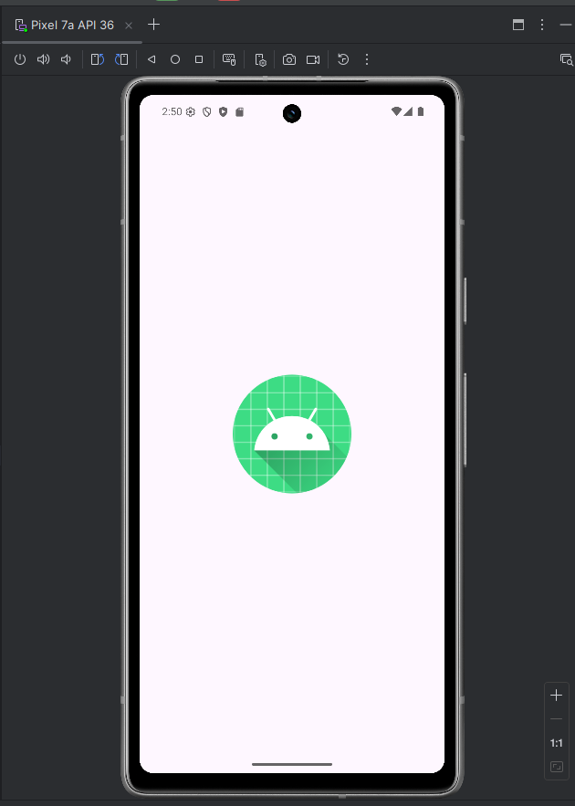
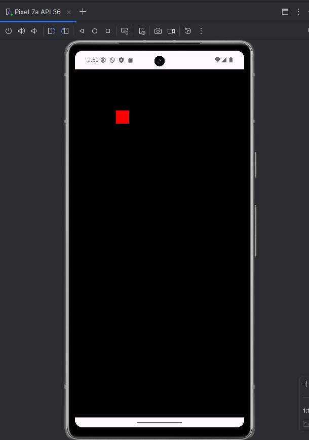

Here's a quick simple project showcasing an issue with Ebitengine playing audio back before the loop has initialized. I've observed this behavior on a virtual device as well as a physical Android device, with the latest stable version of Ebitengine.

When it's not working and is frozen, the app looks like the default "loading Android dev project" image:

And when it's working (when `SetupGame()` isn't called before `mobile.SetGame()`), it should be a red square on a black background. Whether the audio plays depends on if you call `SetupGame()` after `mobile.SetGame()` is called (e.g. from `Game.Update` or `Game.Draw()`). It should look like this:

